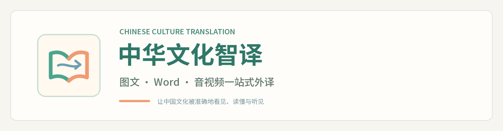
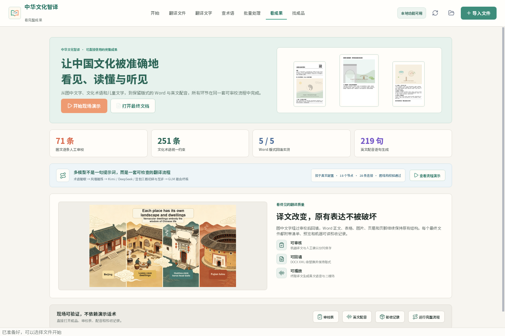
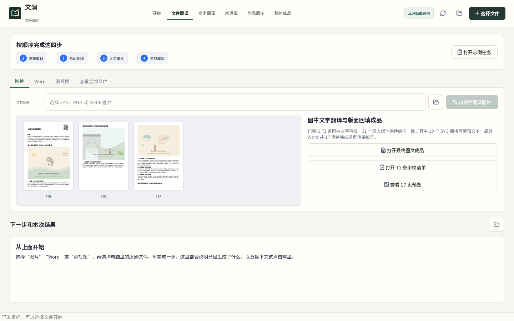

# 译述 YISHU｜中国文化多模态外译工作台



**译文字，也译语境。**

译述把图片、Word、文化术语和声音放进同一条可审校的外译流程。选择素材后，系统会完成内容提取、术语约束、翻译、人工确认与成品导出；第一次使用无需理解项目结构，也不需要先配置在线密钥。

## 直接使用

Windows 发布包建议解压到较短路径（例如 `D:\Yishu`），避免 Windows 对深层素材目录的传统路径长度限制。解压后运行：

```text
Yishu\Yishu.exe
```

- [观看 2 分 25 秒完整功能演示（MP4）](https://github.com/JoyceLeo326/translation-tech-agent-gui/releases/download/v1.3.0/Yishu-v1.3.0-demo.mp4)
- [打开 Vercel 在线展示页](https://yishu-translation-studio.vercel.app)

演示视频依次展示首页、多模态文件翻译、Word 审校回填、音视频外译、扣子多模型精译、文化术语库、批量流程、成果总览和最终文件导出，并配有中文讲解。

打开程序后只需要按三步操作：

1. 把图片、Word、音频或视频拖到“开始”页，也可以点击“从电脑选择”。
2. 按页面上从左到右的编号按钮处理并确认译文；不满足条件的按钮会自动保持不可点击。
3. 在“导出文件”双击打开最终 Word、表格、英文音频和验收记录。

“翻译文件”包含四个入口：

1. **图片**：识别图片中文字并生成中英对照，也可以打开已完成的图文回填成品、71 条审校清单和 17 页预览。
2. **Word**：生成 Excel 译文确认表；自动翻译和人工确认后，生成保留原版式、图片、字体和段落结构的英文 Word。
3. **音视频**：识别内容并生成逐句确认表；确认后使用 Windows 本地英文语音生成 WAV、朗读文本和二维码。
4. **查看全部文件**：检索并双击打开完整整合资源；原协作来源只保留在内部路径中用于追溯。

首页的“打开完整示例”会连接真实 Word、译文确认表、测试音频与终版音频表格，可以直接运行回填和语音生成。“成果总览”集中呈现真实翻译页面、核心成果数字和可现场打开的审校表、配音及验收记录，便于比赛演示。

## 已完成内容

- 图文翻译：71 条人工审校记录、31 个嵌入媒体、10 个可编辑 SVG、17 页 Word 渲染检查与最终回填文档。
- 术语与风格：212 条基础文化术语，另有 40 条带官方来源链接的文化补充语料；加载时按中文术语去重，共 251 条可检索约束。
- DOCX：正文、表格、页眉和页脚提取；标准审校表；人工审核优先、机器译文兜底；XML 级回填与覆盖报告。
- 音视频：在线语音识别入口、逐句审校表、智能翻译、本地 Windows 英文语音合成、朗读文本与二维码。
- 智能翻译：OpenAI 快速翻译、三步精译，以及可解释的扣子多模型精译流程。
- 交付：完整资源随 EXE 分发，统一成品区按任务通道整理，并提供 Excel/JSON 资源索引与 SHA256。

## 统一成品区

无需按协作分组查找文件，最终成品统一位于：

```text
collaboration\integration\final_outputs\ready_to_use\
  01_图文翻译\
  02_术语与风格\
  03_DOCX翻译\
  04_音视频翻译\
  05_资源索引\
```

其中 `05_资源索引\统一交付资源索引.xlsx` 可筛选全部直接使用文件，`最终验收.json` 记录通道完整性、文件数量和哈希状态。原始协作交付仍完整保留在 `collaboration\groups\`，仅作技术追溯。

## 界面预览






其他页面：

- [文字翻译与扣子多模型精译演示](docs/screenshots/workbench-agent.png)
- [文化术语库](docs/screenshots/workbench-terms.png)
- [统一工作流](docs/screenshots/workbench-workflow.png)
- [我的成品](docs/screenshots/workbench-outputs.png)

## 模型配置

本地的文档提取、DOCX 回填、资源浏览和 Windows 语音合成无需 API。智能翻译和音频识别需要在 EXE 同目录创建 `.env`：

```text
OPENAI_API_KEY=你的密钥
OPENAI_MODEL=gpt-4.1-mini
COZE_API_TOKEN=你的扣子个人访问令牌
COZE_WORKFLOW_ID=7661678571702747178
```

密钥只从本机环境读取，不写入仓库和发布包。未配置在线通道时，本地生产功能仍可直接使用；需要联网的按钮会明确提示缺少配置，不会伪造模型结果。

### 扣子多模型精译是什么

“多模型精译（扣子）”不是单次提示词调用，而是一套已校验的 18 节点、28 连接工作流：先提取文化术语和目标文体，再由 Kimi、DeepSeek、豆包分别初译并交叉评估，最后由 GLM 融合终稿。未配置 Token 时，界面会基于仓库中的真实工作流结构展示离线演示；配置后同一按钮直接运行线上流程。

## 本地开发

```powershell
.\scripts\setup_env.ps1
.\scripts\run_dev.ps1
```

重建统一成品区并执行验收：

```powershell
.\.venv\Scripts\python.exe scripts\build_unified_delivery.py
.\.venv\Scripts\python.exe scripts\verify_delivery.py
$env:PYTHONPATH = Join-Path (Get-Location) 'src'
.\.venv\Scripts\python.exe -m unittest discover -s tests -v
```

Windows EXE 打包：

```powershell
.\scripts\build_exe.ps1
```

打包结果：

```text
dist\Yishu\Yishu.exe
```

打包脚本会复制完整 `collaboration\`，不会再只带说明文件或空目录。

## 命令行验收

```powershell
.\.venv\Scripts\python.exe main.py --self-check
.\.venv\Scripts\python.exe main.py --smoke-test
.\.venv\Scripts\python.exe main.py --production-self-check
.\.venv\Scripts\python.exe main.py --integration-report "生成当前整合状态"
.\.venv\Scripts\python.exe main.py --term-search 春节
```

`--production-self-check` 会重新运行五套 DOCX 回填样例，并从真实审校表生成一段可播放英文 WAV，而不是只检查文件是否存在。

## 当前验收基线

- 25 项交付与数据完整性检查全部通过。
- 22 项单元、工作流、界面与本地语音合成测试全部通过。
- 五套 DOCX 样例已重新执行回填，失败 XML 为 0。
- 219 句终版审校文本已在本机生成完整 WAV、朗读文本和二维码。
- 图文终版的媒体数量、SVG 数量、17 页渲染和 SHA256 均已校验。

## 技术结构

- `src/agent_gui_starter/app.py`：PySide6 桌面界面与生产流程交互。
- `src/agent_gui_starter/production.py`：DOCX、Excel、音频与统一成品处理层。
- `src/agent_gui_starter/agent.py`：OpenAI 翻译与语音识别。
- `src/agent_gui_starter/coze.py`：扣子工作流调用。
- `src/agent_gui_starter/integration.py`：资源扫描、术语加载与整合报告。
- `scripts/build_unified_delivery.py`：生成不区分协作分组的最终成品区。
- `scripts/build_exe.ps1`：PyInstaller Windows 打包与完整资源复制。

## 开源协议

项目代码使用 MIT License。Noto Sans SC、Noto Serif SC 遵循 SIL Open Font License 1.1；Lucide 图标遵循 ISC License，许可证文件随资源分发。
