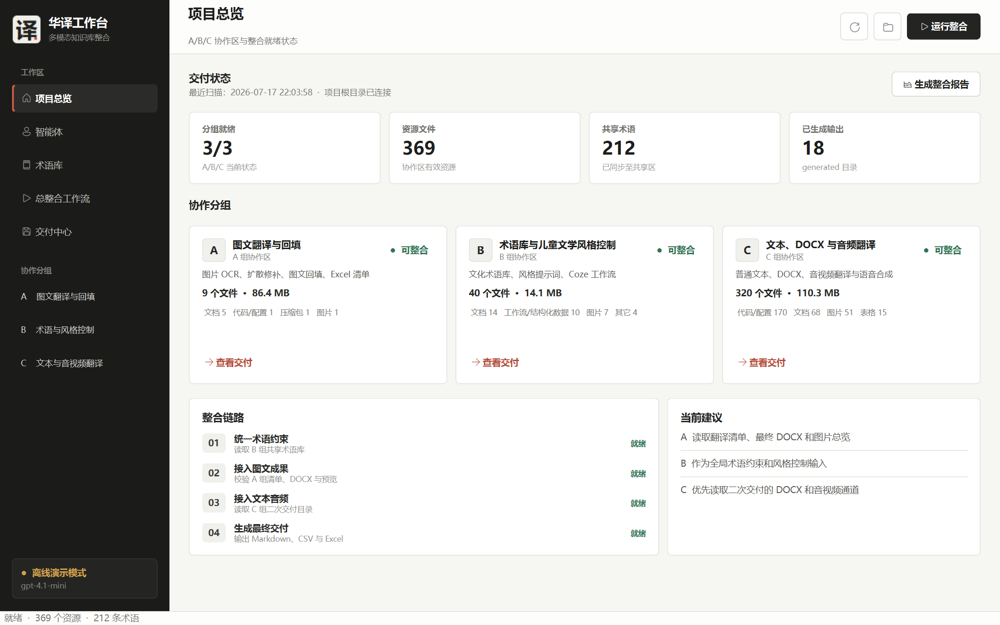

# 中国文化多模态知识库外译智能体

本仓库用于翻译技术大赛项目协作与最终整合。项目目标是用 Python、扣子工作流和大模型能力，整合图片、文本、术语库、儿童文学风格控制、音频翻译和人工审校数据，形成一个可运行、可打包、可开源的桌面工具。

## 当前定位

这个仓库由整合端统一管理：

- A/B/C 组把稳定成果放入自己的协作区。
- 公共资料放入共享区，供所有组读取。
- 最终 GUI、适配器、总清单和输出放入整合区。
- Python 桌面程序使用 PySide6/Qt，最终用 PyInstaller 打包为 Windows exe。

## 当前 GUI 能力

主程序已经升级为现代化 Qt 总整合工作台：

- 项目总览以结构化指标、A/B/C 交付卡和整合链路展示当前状态，不再直接堆叠原始 Markdown。
- 左侧提供总览、智能体、术语库、总整合工作流、交付中心和 A/B/C 分组详情导航。
- 智能体页支持单次调用与“分析、草稿、质检”三步模式，并提供复制、保存和明确的运行状态反馈。
- 术语库页支持中英文与上下文检索，可把选中术语直接加入智能体约束。
- 工作流页可视化展示资源扫描、分组适配、报告导出和智能质检四个阶段。
- 交付中心集中显示最近生成的 Markdown、CSV、Excel、报告摘要和运行日志。
- 支持一键生成整合报告，输出 Markdown、CSV 和 Excel。
- 支持 A/B/C 本地适配器，分别读取图文回填、术语风格、DOCX/音视频交付状态。
- 支持通用智能体调用和总整合工作流调用；未配置 `OPENAI_API_KEY` 时自动使用本地占位结果，便于离线演示和打包验证。
- 支持 1100×720 起的自适应布局；在较窄窗口下指标和分组卡会自动重排，不产生横向滚动。

## 界面预览



## 目录结构

```text
collaboration/
  groups/
    A_image_translation/
    B_terms_style/
    C_text_audio_translation/
  shared/
  integration/
src/agent_gui_starter/
scripts/
```

## 分组区域

### A 组：图文翻译与回填

路径：`collaboration/groups/A_image_translation/`

负责内容：

- 图中文字识别、涂抹修补、翻译和图片回填。
- 待翻译资源抽取到 Excel。
- 人工翻译、审校完成后的技术回填。

### B 组：术语库与儿童文学风格控制

路径：`collaboration/groups/B_terms_style/`

负责内容：

- 中国文化术语抽取与中英对照术语库整理。
- 儿童文学翻译风格提示词设计。
- 大模型交叉验证和人工校对支持。

成熟术语库需要同步到 `collaboration/shared/terminology/`，供 A/C 组和总整合调用。

### C 组：文本、DOCX 与音频翻译

路径：`collaboration/groups/C_text_audio_translation/`

负责内容：

- 普通文本提取与翻译。
- DOCX 文档翻译流程。
- 音频提取、翻译、人工审核和语音合成。

## 共享区

路径：`collaboration/shared/`

用于存放所有组都能读取的稳定公共材料：

- `source_materials/`：统一源材料或样例材料。
- `terminology/`：共享术语库。
- `review_sheets/`：人工翻译、审校、回填状态表。
- `references/`：公共参考资料、提示词说明、来源说明。

## 总整合区

路径：`collaboration/integration/`

用于整合端维护：

- `manifests/`：交付清单、字段规范、整合状态。
- `adapters/`：A/B/C 组成果接入主程序的适配脚本。
- `final_outputs/`：最终提交物、演示输出和打包前结果。

当前交付清单见：`collaboration/integration/manifests/group_deliveries.md`

GUI 生成的整合输出默认进入：

```text
collaboration/integration/final_outputs/generated/
```

该目录用于运行产物，不直接入库；正式提交物确认后再复制到 `final_outputs/` 下的稳定位置。

## 协作规则

1. 各组稳定成果放到自己的 `deliverables/` 下。
2. 需要跨组读取的材料复制到 `collaboration/shared/`。
3. 不提交 `.env`、API Key、Token、账号密码或私有凭据。
4. 临时缓存、运行输出、未整理中间文件放 `scratch/`、`runtime_outputs/` 或本地目录，不作为正式整合入口。
5. 新增交付物后，同步更新 `collaboration/integration/manifests/group_deliveries.md`。
6. 正式协作入口统一以 `collaboration/` 为准，避免重复提交压缩包和中间产物。

## 本地开发

第一次准备环境：

```powershell
.\scripts\setup_env.ps1
```

配置 `.env`：

```text
OPENAI_API_KEY=你的密钥
OPENAI_MODEL=gpt-4.1-mini
```

不配置 `OPENAI_API_KEY` 时，程序会使用本地占位结果，方便验证 GUI 和打包流程。

运行开发版：

```powershell
.\scripts\run_dev.ps1
```

验证构建：

```powershell
.\scripts\verify_build.ps1
```

单元测试：

```powershell
$env:PYTHONPATH = Join-Path (Get-Location) 'src'
.\.venv\Scripts\python.exe -m unittest discover -s tests -v
```

打包 exe：

```powershell
.\scripts\build_exe.ps1
```

打包结果：

```text
dist\CultureTranslationWorkbench\CultureTranslationWorkbench.exe
```

命令行自检：

```powershell
.\.venv\Scripts\python.exe main.py --self-check
.\.venv\Scripts\python.exe main.py --smoke-test
.\.venv\Scripts\python.exe main.py --integration-report "生成当前整合状态"
.\.venv\Scripts\python.exe main.py --term-search 孔子
```

## 主程序位置

- GUI：`src/agent_gui_starter/app.py`
- 智能体连接：`src/agent_gui_starter/agent.py`
- 工作流步骤：`src/agent_gui_starter/workflow.py`
- 总整合引擎：`src/agent_gui_starter/integration.py`
- 环境配置：`src/agent_gui_starter/config.py`

## 验收标准

当前版本按以下标准交付：

1. Qt GUI 可以启动，并能扫描公开仓库内 A/B/C 组协作区。
2. 不配置真实 API Key 时也能离线演示；配置 `.env` 后切换为真实 OpenAI 智能体调用。
3. A/B/C 组已有交付物均有可读入口和本地适配器说明。
4. B 组共享术语库可由 GUI 和命令行检索。
5. 总整合工作流可生成 Markdown、CSV、Excel 输出。
6. `scripts\build_exe.ps1` 可打包 Windows exe；`scripts\verify_build.ps1` 会验证源码自检、烟测、exe 烟测和 GUI 启动。

## 开源协议

本项目使用 MIT License。后续如果比赛或老师要求其它协议，可以再统一调整。
