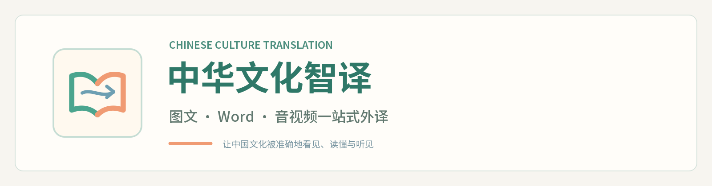
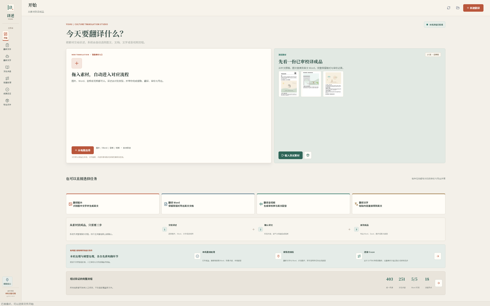
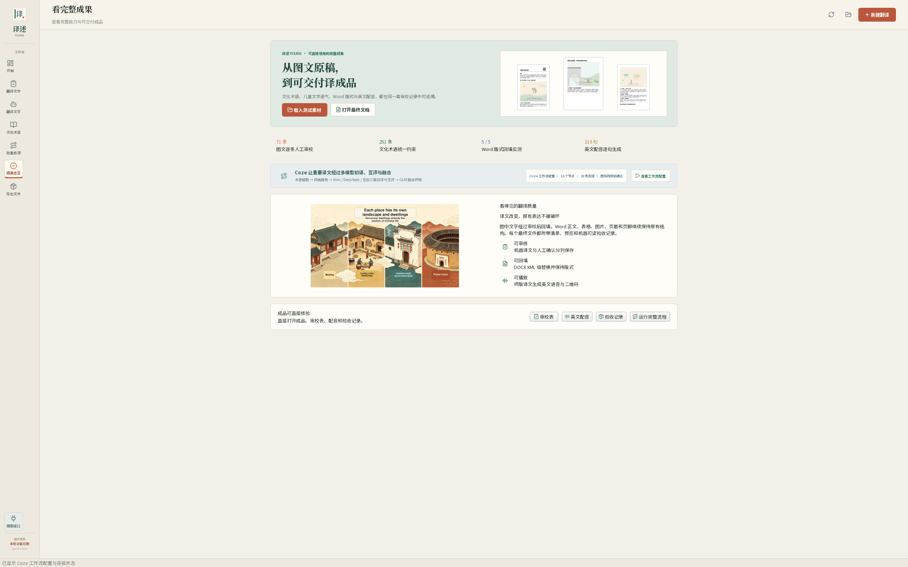
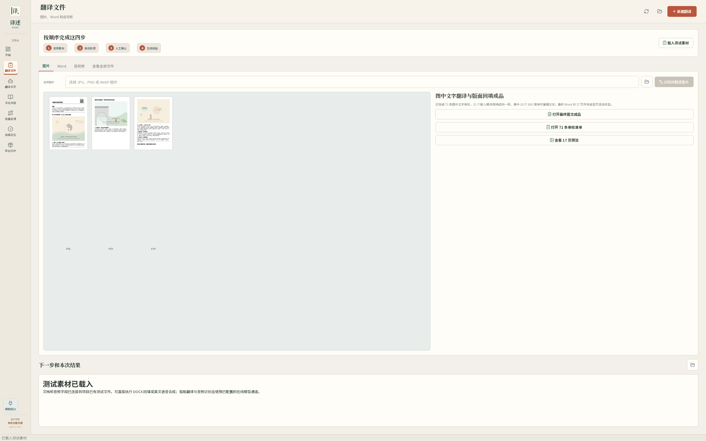

# 译述 YISHU｜中国文化多模态外译工作台



**译文字，也译语境。**

一张带中国文化意象的图片、一份不能破坏排版的 Word、一段等待英文配音的视频，往往要在多个工具和表格之间来回搬运。译述把图片、Word、文化术语和声音放进同一条可审校的外译流程，让译者看见依据、确认译文，再把成品带走。

本机可直接完成文件提取、术语检索、DOCX 回填、资源验收与 Windows 语音合成；翻译新文字、识别图片、转写音频或运行 Coze 工作流前，再到左下角“模型接口”连接自己选择的服务。

## 选择你的入口

| 目标 | 推荐入口 | 适合场景 |
| --- | --- | --- |
| 直接处理真实文件 | [Windows v1.4.1 发布包](https://github.com/JoyceLeo326/translation-tech-agent-gui/releases/download/v1.4.1/Yishu-v1.4.1-windows-x64.zip) | 图片、Word、音视频、术语库、审校与最终导出 |
| 先做一次译文取舍 | [GitHub Pages 在线工作台](https://joyceleo326.github.io/translation-tech-agent-gui/) · [Vercel 备用入口](https://yishu-translation-studio.vercel.app) | 比较三版规则样本、确认、下载审校记录并反馈重排；浏览器不上传文件或调用在线模型 |
| 跟随完整演示 | [操作视频](https://github.com/JoyceLeo326/translation-tech-agent-gui/releases/download/v1.4.0/Yishu-v1.4.0-demo.mp4) | 依次查看首页、模型配置、四类任务和成果验收 |
| 二次开发或复核 | 本仓库源码 | 检查处理链、运行测试、重建交付区或打包 EXE |

## 适合处理什么

| 任务 | 输入 | 人工确认点 | 主要产物 |
| --- | --- | --- | --- |
| 图文外译 | 图片、含图文的 Word | OCR 文本、术语、译文和版面 | 中英对照、回填文档、审校清单与页面预览 |
| DOCX 外译 | 正文、表格、页眉页脚和图片 | Excel 审校表中的逐项译文 | 保留原结构的英文 Word 与覆盖报告 |
| 音视频外译 | 音频、视频或逐句表格 | 转写、分句、译文和发音 | 英文 WAV、朗读文本、二维码与验收记录 |
| 文化术语约束 | 术语表与来源语料 | 术语选词、文体和来源 | 可检索术语库与任务约束 |
| 多模型精译 | 待译文本与 Coze 工作流 | 各模型初译、交叉评价和融合稿 | 可追溯的候选、评价与终稿 |

## 直接使用

Windows 发布包建议解压到较短路径（例如 `D:\Yishu`），避免 Windows 对深层素材目录的传统路径长度限制。解压后运行：

```text
Yishu\Yishu.exe
```

- [下载 Windows v1.4.1 完整版](https://github.com/JoyceLeo326/translation-tech-agent-gui/releases/download/v1.4.1/Yishu-v1.4.1-windows-x64.zip)
- [观看完整操作视频（MP4）](https://github.com/JoyceLeo326/translation-tech-agent-gui/releases/download/v1.4.0/Yishu-v1.4.0-demo.mp4)
- [打开 GitHub Pages 在线展示页](https://joyceleo326.github.io/translation-tech-agent-gui/)
- [打开 Vercel 备用展示页](https://yishu-translation-studio.vercel.app)

下载发布包后，可同时下载同一 Release 中的 `.sha256` 文件，并在 PowerShell 里运行 `Get-FileHash .\Yishu-v1.4.1-windows-x64.zip -Algorithm SHA256` 核对完整性。哈希不一致时不要运行压缩包。

操作视频依次展示首页、模型接口、多模态文件翻译、Word 审校回填、音视频外译、Coze 多模型精译、文化术语库、批量流程、成果总览和最终文件导出，并配有中文讲解。

打开程序后只需要按三步操作：

1. 把图片、Word、音频或视频拖到“开始”页，也可以点击“从电脑选择”。
2. 按页面上从左到右的编号按钮处理并确认译文；不满足条件的按钮会自动保持不可点击。
3. 在“导出文件”双击打开最终 Word、表格、英文音频和验收记录。

需要翻译新内容时，打开左下角“模型接口”，选择 OpenAI、Ollama、LM Studio 或其他兼容服务，填写模型信息后点击“保存并测试”。配置只保存在本机，后续页面会自动使用，无需重复设置。

“翻译文件”包含四个入口：

1. **图片**：识别图片中文字并生成中英对照，也可以打开已完成的图文回填成品、71 条审校清单和 17 页预览。
2. **Word**：生成 Excel 译文确认表；自动翻译和人工确认后，生成保留原版式、图片、字体和段落结构的英文 Word。
3. **音视频**：在线转写并生成逐句确认表；人工确认后优先使用在线 TTS，服务不支持时回退 Windows 本机语音，同时生成 WAV、朗读文本和二维码。
4. **查看全部文件**：检索并双击打开完整整合资源；原协作来源只保留在内部路径中用于追溯。

首页的“载入测试素材”会连接已有 Word、译文确认表、测试音频与终版音频表格，可以直接运行回填和语音生成。“成果总览”集中呈现翻译页面、核心成果数字和可直接打开的审校表、配音及验收记录，便于逐项核验。

## 已完成内容

- 图文翻译：71 条人工审校记录、31 个嵌入媒体、10 个可编辑 SVG、17 页 Word 渲染检查与最终回填文档。
- 术语与风格：212 条基础文化术语，另有 40 条带官方来源链接的文化补充语料；加载时按中文术语去重，共 251 条可检索约束。
- DOCX：正文、表格、页眉和页脚提取；标准审校表；人工审核优先、机器译文兜底；XML 级回填与覆盖报告。
- 音视频：在线语音识别入口、逐句审校表、智能翻译、本地 Windows 英文语音合成、朗读文本与二维码。
- 智能翻译：通用模型 API 快速翻译、三步精译，以及作为核心亮点的 Coze 多模型精译工作流。
- 交付：完整资源随 EXE 分发，统一成品区按任务通道整理，并提供 Excel/JSON 资源索引与 SHA256。

## 统一成品区

无需按协作分组查找文件，最终成品统一位于：

```text
collaboration\integration\final_outputs\ready_to_use\
  01_图文翻译\
  02_术语与风格\
  03_DOCX翻译\
  04_音视频翻译\
  05_资源索引\
```

其中 `05_资源索引\统一交付资源索引.xlsx` 可筛选全部直接使用文件，`最终验收.json` 记录通道完整性、文件数量和哈希状态。原始协作交付仍完整保留在 `collaboration\groups\`，仅作技术追溯。

## 界面预览







其他页面：

- [文字翻译与 Coze 多模型精译](docs/screenshots/workbench-agent.png)
- [文化术语库](docs/screenshots/workbench-terms.png)
- [统一工作流](docs/screenshots/workbench-workflow.png)
- [我的成品](docs/screenshots/workbench-outputs.png)
- [模型接口与在线能力](docs/screenshots/workbench-settings.png)

## 模型配置

本地的文档提取、DOCX 回填、资源浏览和 Windows 语音合成无需 API。推荐直接在左下角“模型接口”完成配置；高级用户也可以在 EXE 同目录创建 `.env`：

```text
OPENAI_API_KEY=你的密钥
OPENAI_BASE_URL=https://api.openai.com/v1
OPENAI_MODEL=gpt-4.1-mini
MODEL_API_PROTOCOL=responses
TRANSCRIPTION_MODEL=whisper-1
SPEECH_MODEL=gpt-4o-mini-tts
SPEECH_VOICE=alloy
COZE_API_TOKEN=你的 Coze Personal Access Token
COZE_WORKFLOW_ID=7661678571702747178
```

密钥只从本机环境读取，不写入仓库和发布包。未配置在线通道时，本地生产功能仍可直接使用；需要联网的按钮会明确提示缺少配置，不会伪造模型结果。

### Coze 多模型精译是什么

Coze 多模型精译使用一套已校验的 18 节点、28 连接工作流：先提取文化术语和目标文体，再由 Kimi、DeepSeek、豆包分别初译并交叉评估，最后由 GLM 融合终稿。未配置 Token 时，界面只显示工作流结构、校验依据和连接步骤，不生成译文；配置并测试成功后，同一入口执行线上工作流。

详细设计见 [智能体架构](docs/architecture/AGENT_ARCHITECTURE.md) 和 [工作流架构](docs/architecture/WORKFLOW_ARCHITECTURE.md)。

## 隐私、安全与局限

- 在线展示页只用于介绍工作台，不接收待翻译文件，也不代替 Windows 桌面程序。
- API Key、模型地址和 Token 由使用者在本机配置；真实值不应写入 README、提交、Issue、日志或共享压缩包。
- 本地文件处理、DOCX 回填、资源浏览和 Windows 语音可以独立运行；视觉识别、在线转写、模型翻译和 Coze 工作流需要对应服务可用。
- 模型输出不是已审定译文。文化术语、专名、数字、引文、敏感表述和最终版式都必须由人复核后再交付。
- 第三方模型、Coze 与兼容服务各自拥有数据处理、配额和地域规则；使用前应阅读对应服务条款，并只发送获授权的材料。
- Windows 发布包包含较深的验收素材目录，建议解压到短路径；在其他操作系统上应从源码运行，并自行验证字体、语音与文档兼容性。
- 仓库中的测试素材和统一成品区用于复现能力，不代表所有新文件都能在不审校的情况下保持完全相同的版面。

## 本地开发

```powershell
.\scripts\setup_env.ps1
.\scripts\run_dev.ps1
```

重建统一成品区并执行验收：

```powershell
.\.venv\Scripts\python.exe scripts\build_unified_delivery.py
.\.venv\Scripts\python.exe scripts\verify_delivery.py
$env:PYTHONPATH = Join-Path (Get-Location) 'src'
.\.venv\Scripts\python.exe -m unittest discover -s tests -v
```

Windows EXE 打包：

```powershell
.\scripts\build_exe.ps1
```

打包结果：

```text
dist\Yishu\Yishu.exe
```

打包脚本会复制完整 `collaboration\`，不会再只带说明文件或空目录。

## 命令行验收

```powershell
.\.venv\Scripts\python.exe main.py --self-check
.\.venv\Scripts\python.exe main.py --smoke-test
.\.venv\Scripts\python.exe main.py --production-self-check
.\.venv\Scripts\python.exe main.py --integration-report "生成当前整合状态"
.\.venv\Scripts\python.exe main.py --term-search 春节
```

`--production-self-check` 会重新运行五套 DOCX 回填样例，并从已审校表格生成一段可播放英文 WAV，同时检查生成文件内容。

## 当前验收基线

- 25 项交付与数据完整性检查全部通过。
- 29 项单元、模型适配、工作流、界面与本地语音合成测试全部通过。
- 五套 DOCX 样例已重新执行回填，失败 XML 为 0。
- 219 句终版审校文本已在本机生成完整 WAV、朗读文本和二维码。
- 图文终版的媒体数量、SVG 数量、17 页渲染和 SHA256 均已校验。

## 技术结构

- `src/agent_gui_starter/app.py`：PySide6 桌面界面与生产流程交互。
- `src/agent_gui_starter/production.py`：DOCX、Excel、音频与统一成品处理层。
- `src/agent_gui_starter/agent.py`：Responses / Chat Completions 双协议模型适配、视觉、转写与 TTS。
- `src/agent_gui_starter/config.py`：本地模型接口配置、安全保存和预设管理。
- `src/agent_gui_starter/coze.py`：Coze 多模型精译工作流调用。
- `src/agent_gui_starter/integration.py`：资源扫描、术语加载与整合报告。
- `scripts/build_unified_delivery.py`：生成不区分协作分组的最终成品区。
- `scripts/build_exe.ps1`：PyInstaller Windows 打包与完整资源复制。

## 开源协议

项目代码使用 MIT License。Noto Sans SC、Noto Serif SC 遵循 SIL Open Font License 1.1；Lucide 图标遵循 ISC License，许可证文件随资源分发。
