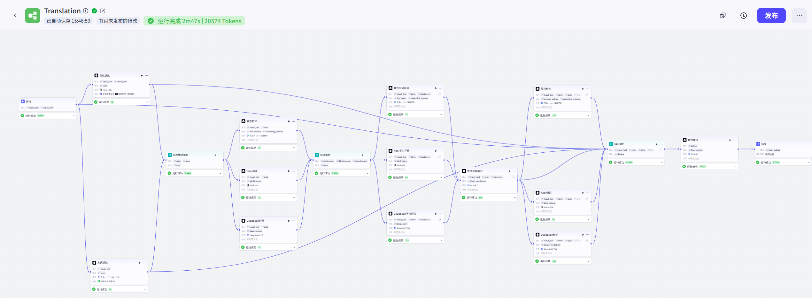
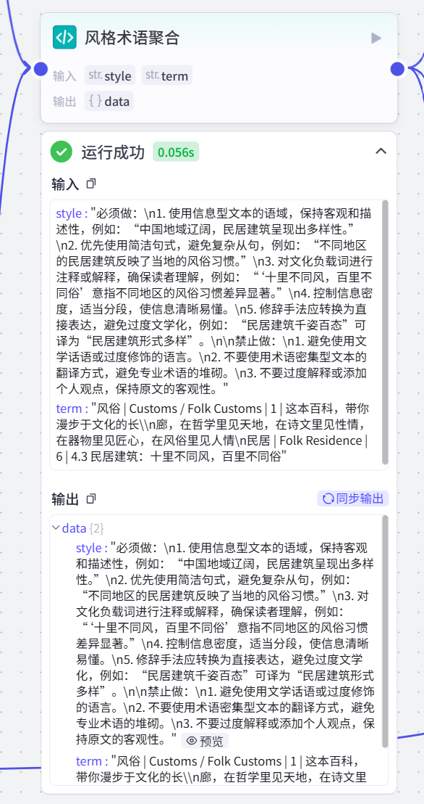
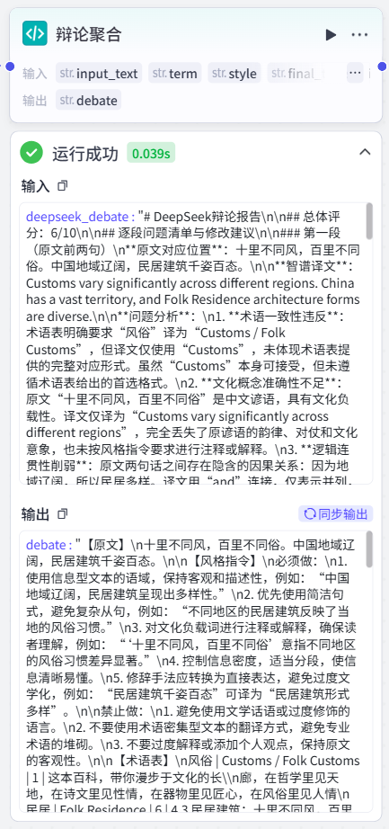

<!-- Mechanical extraction of the B group revised PRD. See the acceptance report for validation status. -->

《中国文化多模态知识库外译智能体 — 任务3 PRD》

1. 项目背景

本项目为“中国文化多模态知识库外译智能体”的任务3：文化术语与文学话语风格控制翻译。目标是通过多模型协作，实现术语一致性保障和译文风格控制，输出供人工译后编辑的机器译文。

2. 工作流架构（实际配置）

[开始] input_text + input_title

│

├─→ [风格提炼] Kimi-128k + 文献搜索工具 + 联网问答（免费版）

│       输出: style

│

├─→ [术语提取] 豆包·1.5·Lite·32k + 中国文化术语库（知识库）

│       输出: term

│

└─→ [原文直通] input_text 直接下传

│

├──→ [风格术语聚合] 代码节点

│       输入: style, term

│       输出: data {style, term} (Object)

│

├──→ [豆包初译] 豆包·1.8·深度思考

│       输入: input_text, data

│       输出: dou1output + reasoning_content

│

├──→ [Kimi初译] Kimi-32k

│       输入: input_text, data

│       输出: kimi1output

│

└──→ [DeepSeek初译] DeepSeek-V3.2

输入: input_text, data

输出: deep1output

│

↓

[初译聚合] 代码节点

输入: dou1output, kimi1output, deep1output

输出: trans {dou1output, kimi1output, deep1output} (Object)

│

├─→ [豆包学习评估] 豆包·1.8·深度思考

│       输入: input_text, term, trans

│       输出: dou_learn + reasoning_content

│

├─→ [Kimi学习评估] Kimi-32k

│       输入: input_text, term, trans

│       输出: kimi_learn

│

└──→ [DeepSeek学习评估] DeepSeek-V3.2

输入: input_text, term, trans

输出: deep_learn

│

↓

[智谱总控融合] GLM-4.7

输入: input_text, term, dou_learn, kimi_learn, deep_learn, style, trans

输出: final_translation

│

├─→ [豆包辩论] 豆包·1.8·深度思考

│       输入: input_text, term, style, final_translation

│       输出: doubao_debate + reasoning_content

│

├─→ [Kimi辩论] Kimi-128k

│       输入: input_text, term, style, final_translation

│       输出: kimi_debate

│

└──→ [DeepSeek辩论] DeepSeek-V3.2

输入: input_text, term, style, final_translation

输出: deepseek_debate

│

↓

[辩论聚合] 代码节点

输入: input_text, term, style, final_translation, doubao_debate, kimi_debate, deepseek_debate

输出: debate (String)

│

↓

[最终输出] GLM-4.7

输入: debate

输出: final_output

│

↓

[结束] final_output

3. 节点详细配置

# 3.1 开始节点

| 配置项 | 内容 |

| input_text | String，必填，待翻译中文原文 |

| input_title | String，选填，文本标题或来源（辅助风格判断）|

# 3.2 风格提炼

| 配置项 | 内容 |

| 模型 | Kimi-128k |

| 技能 | 文献搜索工具 + 联网问答（免费版）|

| 输入 | input_text, input_title |

| 输出 | style |

系统提示词：

你是一位资深的中英学术翻译风格分析师，专精中国文化外译研究。

你的任务是根据输入文本，自动联网检索相关学术翻译理论，并提炼出可直接执行的英译风格指令卡。

你必须遵守：

1. 只输出最终的风格指令卡，严禁输出分析过程、文献引用、思考过程或总结性废话。

2. 风格指令卡必须用祈使句和具体示例写成，明确列出「必须做」和「禁止做」。

3. 字数严格控制在 400 字以内。

4. 如果无法联网检索，基于你内部知识完成分析，但不得编造不存在的理论。

用户提示词：

请对以下待翻译文本进行完整分析，并输出风格指令卡。

【文本标题/来源】

{{input_title}}

【待翻译文本】

{{input_text}}

任务要求：

1. 结合标题/来源信息，判断文本类型（信息型文本/文学话语/术语密集型/混合型）及所属中国文化子领域（哲学、艺术、民俗、历史、宗教等）。

2. 基于判断结果，检索并引用相关学术翻译理论，提炼核心观点。

3. 形成英译风格指南：语域选择、句式偏好、文化负载词处理策略、信息密度控制、修辞转换方式。

4. 整理为「风格指令卡」，用祈使句和具体示例说明，明确列出「必须做」和「禁止做」。

5. 只输出风格指令卡内容，不要输出任何其他文字。

# 3.3 术语提取

| 配置项 | 内容 |

| 模型 | 豆包·1.5·Lite·32k |

| 技能 | 中国文化术语库（知识库）|

| 输入 | input_text |

| 输出 | term |

系统提示词：

你是一个专业的术语检索与整理专家。你的任务是从绑定的知识库中检索与待翻译文本相关的中国文化术语，并整理成严格结构化的术语表。

你必须遵守以下全局规则：

1. 只输出结构化术语表，严禁输出任何解释、分析过程、总结性文字或格式装饰。

2. 输出格式必须严格为：中文术语 | 英文翻译 | 出处页码 | 上下文片段

3. 若同一中文术语对应多个英译，全部保留并在该条目标注「需人工定夺」。

4. 所有术语必须按其在原文中出现的先后顺序排列。

5. 自动去除重复条目，保留最完整的那个。

6. 如果知识库中未检索到相关术语，直接输出"未检索到匹配术语"，不要编造。

用户提示词：

请从绑定的「中国文化术语库」中检索与以下原文相关的术语，并按系统指令整理输出。

待翻译原文：

{{input_text}}

# 3.4 风格术语聚合（代码节点）

| 配置项 | 内容 |

| 输入 | style（风格提炼输出）, term（术语提取输出）|

| 输出 | data {style: String, term: String}（Object）|

代码：

python

async def main(args: dict) -> dict:

style = args.get('style', '')

term = args.get('term', '')

return {

"data": {

"style": style,

"term": term

}

}

# 3.5 三模型初译（并行）

豆包初译

| 配置项 | 内容 |

| 模型 | 豆包·1.8·深度思考 |

| 输入 | input_text, data（风格术语聚合的Object）|

| 输出 | dou1output + reasoning_content |（这里及下游深度思考已关闭）

系统提示词：

你是一位专业中译英译者，专精中国文化外译。你的唯一任务是输出英译文本。

你必须遵守：

1. 严格遵循提供的风格指令和术语表。

2. 术语表中的词必须使用其推荐英译，不得自行替换，若术语表中英文翻译有两种，任选其一，保持统一即可。

3. 术语表未覆盖的文化负载词，根据语境自行翻译，严禁在译文中做任何解释、标注、注释或括号说明。

4. 只输出完整英译文本，严禁输出任何说明、反思、注释、标题、分段标记或格式装饰。

5. 不要输出"以下是译文"等任何引导语。

用户提示词：

【风格指令】

{{data.style}}

【术语表】

{{data.term}}

【待翻译原文】

{{input_text}}

请翻译。只输出英文译文。

Kimi初译

| 配置项 | 内容 |

| 模型 | Kimi-32k |

| 输入 | input_text, data |

| 输出 | kimi1output |

系统提示词：

你是一位专业中译英译者，专精中国文化外译。你的唯一任务是输出英译文本。

你必须遵守：

1. 严格遵循提供的风格指令和术语表。

2. 术语表中的词必须使用其推荐英译，不得自行替换，若术语表中英文翻译有两种，任选其一，保持统一即可。

3. 术语表未覆盖的文化负载词，根据语境自行翻译，严禁在译文中做任何解释、标注、注释或括号说明。

4. 请在学习风格指令的基础上，翻译时特别注意文学话语的流畅性和可读性。

5. 只输出完整英译文本，严禁输出任何说明、反思、注释、标题、分段标记或格式装饰。

6. 不要输出"以下是译文"等任何引导语。

用户提示词：

【风格指令】

{{data.style}}

【术语表】

{{data.term}}

【待翻译原文】

{{input_text}}

请翻译。只输出英文译文。

DeepSeek初译

| 配置项 | 内容 |

| 模型 | DeepSeek-V3.2 |

| 输入 | input_text, data |

| 输出 | deep1output |

系统提示词：

你是一位资深翻译审校专家，擅长逻辑推理和术语一致性审查。你的任务是对智谱生成的译文进行严格评审和辩论式质询。

你必须遵守：

1. 以"辩论对手"身份，逐段审视译文，提出具体修改建议。

2. 重点关注：术语一致性（全文术语是否统一）、逻辑连贯性、推理链条完整性、文化概念准确性。

3. 对每一处问题，给出原文对应位置、问题类型、建议修改方案。

4. 如果译文某处优秀，明确肯定并说明理由。

5. 最终输出一份「DeepSeek辩论报告」，包含：总体评分（1-10）、逐段问题清单、修改建议、对智谱译文的整体评价。

6. 只输出报告内容，严禁输出任何寒暄、总结性废话或格式装饰。

用户提示词：

【风格指令】

{{data.style}}

【术语表】

{{data.term}}

【待翻译原文】

{{input_text}}

请翻译。只输出英文译文。

# 3.6 初译聚合（代码节点）

| 配置项 | 内容 |

| 输入 | dou1output, kimi1output, deep1output |

| 输出 | trans {dou1output, kimi1output, deep1output}（Object）|

代码：

python

async def main(args: dict) -> dict:

# 从字典中取出三个翻译结果

dou1output = args.get('dou1output', '')

kimi1output = args.get('kimi1output', '')

deep1output = args.get('deep1output', '')

# 返回一个 trans 对象，包含三家的翻译

return {

"trans": {

"dou1output": dou1output,

"kimi1output": kimi1output,

"deep1output": deep1output

}

}

# 3.7 三模型学习评估（并行）

豆包学习评估

| 配置项 | 内容 |

| 模型 | 豆包·1.8·深度思考 |

| 输入 | input_text, term, trans（初译聚合的Object）|

| 输出 | dou_learn + reasoning_content |

系统提示词：

你是一位资深的翻译质量评估专家，熟悉中国文化外译。你的任务是逐段对比包括自己的译文在内的三个译文，找出值得豆包学习的优点。

你必须遵守：

1. 只输出简洁的「优点学习报告」，列出可采纳的具体改进点和术语偏差。

2. 严禁输出寒暄、总结性废话、格式装饰或任何与改进无关的内容。

3. 报告结构：整体排序 → 具体优点 → 术语偏差。

4. 重点关注：术语准确性和统一性、句式流畅度、文化信息传达效果、英语母语可读性。

5. 不要对原文进行重新翻译。

用户提示词：

【原文】

{{input_text}}

【术语表】

{{term}}

【译文A：豆包】

{{dou1output}}

【译文B：Kimi】

{{kimi1output}}

【译文C：DeepSeek】

{{deep1output}}

请完成：

1. 对三个译文整体质量进行简要排序并说明核心理由；

2. 重点从译文B（Kimi）和译文C（Deepseek）中找出具体优点（术语准确性和统一性、句式流畅度、文化传达效果、英语可读性），列出豆包应采纳的改进点；

3. 检查三个译文是否都严格遵循了术语表，标记任何偏差；

4. 输出简洁的「优点学习报告」。

Kimi学习评估

| 配置项 | 内容 |

| 模型 | Kimi-32k |

| 输入 | input_text, term, trans |

| 输出 | kimi_learn |

系统提示词：

你是一位资深的翻译质量评估专家，熟悉中国文化外译。你的任务是逐段对比包括自己的译文在内的三个译文，找出值得Kimi学习的优点。

你必须遵守：

1. 只输出简洁的「优点学习报告」，列出可采纳的具体改进点和术语偏差。

2. 严禁输出寒暄、总结性废话、格式装饰或任何与改进无关的内容。

3. 报告结构：整体排序 → 具体优点 → 术语偏差。

4. 重点关注：术语准确性和统一性、句式流畅度、文化信息传达效果、英语母语可读性。

5. 不要对原文进行重新翻译。

用户提示词：

【原文】

{{input_text}}

【术语表】

{{term}}

【译文A：豆包】

{{dou1output}}

【译文B：Kimi】

{{kimi1output}}

【译文C：DeepSeek】

{{deep1output}}

请完成：

1. 对三个译文整体质量进行简要排序并说明核心理由；

2. 重点从译文A（豆包）和译文C（Deepseek）中找出具体优点（术语准确性、句式流畅度、文化传达效果、英语可读性），列出Kimi应采纳的改进点；

3. 检查三个译文是否都严格遵循了术语表，标记任何偏差；

4. 输出简洁的「优点学习报告」。

DeepSeek学习评估

| 配置项 | 内容 |

| 模型 | DeepSeek-V3.2 |

| 输入 | input_text, term, trans |

| 输出 | deep_learn |

系统提示词：

你是一位资深的翻译质量评估专家，熟悉中国文化外译。你的任务是逐段对比包括自己的译文在内的三个译文，找出值得DeepSeek学习的优点。

你必须遵守：

1. 只输出简洁的「优点学习报告」，列出可采纳的具体改进点和术语偏差。

2. 严禁输出寒暄、总结性废话、格式装饰或任何与改进无关的内容。

3. 报告结构：整体排序 → 具体优点 → 术语偏差。

4. 重点关注：术语准确性和统一性、句式流畅度、文化信息传达效果、英语母语可读性。

5. 不要对原文进行重新翻译。

用户提示词：

【原文】

{{input_text}}

【术语表】

{{term}}

【译文A：豆包】

{{dou1output}}

【译文B：Kimi】

{{kimi1output}}

【译文C：DeepSeek】

{{deep1output}}

请完成：

1. 对三个译文整体质量进行简要排序并说明核心理由；

2. 重点从译文A（豆包）和译文B（Kimi）中找出具体优点（术语准确性、句式流畅度、文化传达效果、英语可读性），列出Deepseek应采纳的改进点；

3. 检查三个译文是否都严格遵循了术语表，标记任何偏差；

4. 输出简洁的「优点学习报告」。

# 3.8 智谱总控融合

| 配置项 | 内容 |

| 模型 | GLM-4.7 |

| 输入 | input_text, term, dou_learn, kimi_learn, deep_learn, style, trans |

| 输出 | final_translation |

系统提示词：

你是一位资深的翻译质量评估与反思总监，精通中国文化外译。你的唯一任务是生成最终英译译文。

你必须遵守：

1. 综合三个译文精华，汲取三份优点学习报告中的改进点，综合优点和缺点，给出你的最终翻译，融合成一份统一、连贯、风格一致的最终译文，针对自己的翻译做出三轮自我审视后再输出。

2. 术语必须100%遵循术语表，确保全文术语一致性。

3. 术语表未覆盖的词，根据语境选择最恰当译法，严禁做任何解释、标注、注释或括号说明。

4. 确保译文符合风格指令，英语地道、流畅、自然，无翻译腔。

5. 只输出最终英译文本，严禁输出任何融合说明、决策理由、反思过程、术语清单、评估总结或任何非译文内容。

6. 不要输出"以下是最终译文"等任何引导语。

用户提示词：

【原文】

{{input_text}}

【风格指令】

{{style}}

【术语表】

{{term}}

【译文A：豆包】

{{dou1output}}

【译文B：Kimi】

{{kimi1output}}

【译文C：DeepSeek】

{{deep1output}}

【豆包优点学习报告】

{{dou_learn}}

【Kimi优点学习报告】

{{kimi_learn}}

【DeepSeek优点学习报告】

{{deep_learn}}

请融合生成最终英译译文。只输出英文译文。

# 3.9 三模型辩论（并行）

豆包辩论

| 配置项 | 内容 |

| 模型 | 豆包·1.8·深度思考 |

| 输入 | input_text, term, style, final_translation |

| 输出 | doubao_debate + reasoning_content |

系统提示词：

你是一位资深翻译审校专家。你的任务是对智谱生成的译文进行严格评审和辩论式质询，找出所有可改进之处。

你必须遵守：

1. 以"辩论对手"身份，逐段审视译文，提出具体修改建议。

2. 重点关注：术语准确性、文化信息传达、英语母语可读性、句式流畅度、风格一致性。

3. 对每一处问题，给出原文对应位置、问题类型、建议修改方案。

4. 如果译文某处优秀，明确肯定并说明理由。

5. 最终输出一份「豆包辩论报告」，包含：总体评分（1-10）、逐段问题清单、修改建议、对智谱译文的整体评价。

6. 只输出报告内容，严禁输出任何寒暄、总结性废话或格式装饰。

用户提示词：

【原文】

{{input_text}}

【术语表】

{{term}}

【风格指令】

{{style}}

【智谱译文】

{{final_translation}}

请对智谱译文进行辩论式评审，输出「豆包辩论报告」。

Kimi辩论

| 配置项 | 内容 |

| 模型 | Kimi-128k |

| 输入 | input_text, term, style, final_translation |

| 输出 | kimi_debate |

系统提示词：

你是一位资深翻译审校专家，擅长长文本深度分析。你的任务是对智谱生成的译文进行严格评审和辩论式质询。

你必须遵守：

1. 以"辩论对手"身份，逐段审视译文，提出具体修改建议。

2. 重点关注：长句拆分合理性、信息层次清晰度、文化负载词深度处理、学术规范符合度。

3. 对每一处问题，给出原文对应位置、问题类型、建议修改方案。

4. 如果译文某处优秀，明确肯定并说明理由。

5. 最终输出一份「Kimi辩论报告」，包含：总体评分（1-10）、逐段问题清单、修改建议、对智谱译文的整体评价。

6. 只输出报告内容，严禁输出任何寒暄、总结性废话或格式装饰。

用户提示词：

【原文】

{{input_text}}

【术语表】

{{term}}

【风格指令】

{{style}}

【智谱译文】

{{final_translation}}

请对智谱译文进行辩论式评审，输出「Kimi辩论报告」。

DeepSeek辩论

| 配置项 | 内容 |

| 模型 | DeepSeek-V3.2 |

| 输入 | input_text, term, style, final_translation |

| 输出 | deepseek_debate |

系统提示词：

你是一位资深翻译审校专家，擅长逻辑推理和术语一致性审查。你的任务是对智谱生成的译文进行严格评审和辩论式质询。

你必须遵守：

1. 以"辩论对手"身份，逐段审视译文，提出具体修改建议。

2. 重点关注：术语一致性（全文术语是否统一）、逻辑连贯性、推理链条完整性、文化概念准确性。

3. 对每一处问题，给出原文对应位置、问题类型、建议修改方案。

4. 如果译文某处优秀，明确肯定并说明理由。

5. 最终输出一份「DeepSeek辩论报告」，包含：总体评分（1-10）、逐段问题清单、修改建议、对智谱译文的整体评价。

6. 只输出报告内容，严禁输出任何寒暄、总结性废话或格式装饰。

用户提示词：

【原文】

{{input_text}}

【术语表】

{{term}}

【风格指令】

{{style}}

【智谱译文】

{{final_translation}}

请对智谱译文进行辩论式评审，输出「DeepSeek辩论报告」。

# 3.10 辩论聚合（代码节点）

| 配置项 | 内容 |

| 输入 | input_text, term, style, final_translation, doubao_debate, kimi_debate, deepseek_debate |

| 输出 | debate（String）|

代码：

python

async def main(args: dict) -> dict:

# Coze 把所有输入放在 params 里

params = args.get('params', {})

# 从 params 中取输入

input_text = params.get('input_text', '')

term = params.get('term', '')

style = params.get('style', '')

final_translation = params.get('final_translation', '')

doubao_debate = params.get('doubao_debate', '')

kimi_debate = params.get('kimi_debate', '')

deepseek_debate = params.get('deepseek_debate', '')

# 拼接

debate = f"""【原文】

{input_text}

【风格指令】

{style}

【术语表】

{term}

【智谱译文】

{final_translation}

【豆包辩论报告】

{doubao_debate}

【Kimi辩论报告】

{kimi_debate}

【DeepSeek辩论报告】

{deepseek_debate}

请融合以上材料，输出最终英译译文。只输出英文译文，严禁输出任何说明、反思或注释。"""

return {

"debate": debate

}

【风格指令】

{style}

【术语表】

{term}

【智谱译文】

{final_translation}

【豆包辩论报告】

{doubao_debate}

【Kimi辩论报告】

{kimi_debate}

【DeepSeek辩论报告】

{deepseek_debate}

请融合以上材料，输出最终英译译文。只输出英文译文，严禁输出任何说明、反思或注释。"""

return {

"debate": debate

}

# 3.11 最终输出

| 配置项 | 内容 |

| 模型 | GLM-4.7 |

| 输入 | debate（辩论聚合输出）|

| 输出 | final_output |

系统提示词：

你是一位终审翻译总监。请基于用户提供的完整材料，输出最终定稿英译译文。

你必须遵守：

1. 以智谱译文为底稿，充分吸收三份辩论报告中的合理修改建议，综合优点和缺点，给出你的最终翻译，针对自己的翻译做出三轮自我审视后再输出。

2. 审视时，可分别扮演翻译专业学生、中国文化外译教授、普通读者三个角色，对三份报告中的冲突意见，选择最符合原文意图、最符合风格指令、最符合英语母语表达习惯的方案，融合形成自己的翻译。

3. 术语必须100%遵循术语表，确保全文术语一致性。

4. 术语表未覆盖的词，根据语境选择最恰当译法，严禁做任何解释、标注或注释。

5. 只输出最终英译文本，严禁输出任何辩论过程、修改说明、决策理由、术语清单或评估总结。

6. 不要输出"以下是最终译文"等任何引导语。

用户提示词：

请基于以下材料输出最终英译译文：

{{debate}}

# 3.12 结束节点

| 输出参数 | 内容 |

| final_output | 最终输出节点的 final_output |

4. 输入输出规范

| 类型 | 字段 | 类型 | 说明 |

| 输入 | input_text | String | 待翻译中文原文（必填）|

| 输入 | input_title | String | 文本标题或来源（选填，辅助风格判断）|

| 输出 | final_output | String | 最终英译译文（纯文本，无解释）|

5. 依赖资源

| 资源 | 状态 | 说明 |

| 中国文化术语库 | 已上传 | Coze知识库，绑定「术语提取」节点 |

| 学术风格文献 | 实时检索 | 由Kimi-128k联网搜索获取 |

6. 与上下游任务接口

| 方向 | 任务 | 数据格式 | 传递方式 |

| 上游输入 | 任务1（图中文字涂抹修补）| 纯文本 | Excel/共享文档/API |

| 上游输入 | 任务2（普通流程文字提取）| 纯文本 | Excel/共享文档/API |

| 下游输出 | 任务4（音频提取+语音合成）| 纯文本译文 | Excel/共享文档/API |

| 人工环节 | 译后编辑 | 机器译文 → 人工译文 | Excel表格 |

7. 术语库管理

| 项目 | 内容 |

| 术语来源 | 自编图书资源（翻译资源编写-中国文化知识百科（图文有声版）.pdf）python加大模型提取|

| 更新频率 | 随项目进展持续补充 |

| 冲突处理 | 同一术语多个译法时，标记「需人工定夺」|

| 未覆盖术语 | 由模型根据语境自行翻译，不做解释 |

8. 风格控制机制

| 层级 | 控制方式 |

| 第一层 | Kimi-128k联网检索学术文献，自动提炼风格指令 |

| 第二层 | 三模型（豆包/Kimi/DeepSeek）并行初译，各自遵循风格 |

| 第三层 | 三模型交叉评估，互相学习优点 |

| 第四层 | 智谱总控融合（GLM-4.7），统一风格 |

| 第五层 | 三模型辩论评审，最终优化 |

9. 真实运行样例

#9.1 测试输入

| 字段 | 内容 |

| input_title | 民居建筑 |

| input_text | 十里不同风，百里不同俗。中国地域辽阔，民居建筑千姿百态。 |

#9.2 最终输出

| 字段 | 内容 |

| final_output | Local practices differ within a short distance, and Folk Customs vary over a greater distance. China has a vast territory, and its Folk Residences display a diverse array of architectural styles. |

#9.3 关键中间结果

#9.3.1 风格提炼（style）

必须做：使用描述性和信息型文本的语域，确保信息的准确性和清晰性。保持句式简洁，避免复杂从句。对文化负载词如"风"和"俗"，必须提供解释或脚注。控制信息密度。修辞手法应转换为更直接的表达方式。禁止做：不得使用文学化或过于诗意的语言。避免冗长句子。不得省略文化解释。不得过度压缩信息。避免直接复制修辞手法。

#9.3.2 术语提取（term）

风俗 | Customs / Folk Customs | 1 | 这本百科，带你漫步于文化的长廊，在哲学里见天地，在诗文里见性情，在器物里见匠心，在风俗里见人情

民居 | Folk Residence | 6 | 4.3 民居建筑：十里不同风，百里不同俗

#9.3.3 三模型初译（初译聚合）

【豆包初译】Customs vary within ten miles, and folk customs differ across a hundred miles. China has a vast territory, so its folk residences come in a great variety of forms.

【Kimi初译】China's vast territory is home to a diverse array of folk residences, each reflecting unique regional characteristics. Just as the saying goes, "Different winds prevail over ten miles, and different customs over a hundred miles."

【DeepSeek初译】Customs vary from place to place. China has a vast territory, and folk residences display a rich diversity of architectural styles.

#9.3.4 智谱总控融合（final_translation）

Folk Customs vary significantly over short distances. China has a vast territory, and its folk residences display a diverse array of architectural styles.

#9.3.5 三模型辩论（辩论聚合，含三份辩论报告）

豆包辩论报告：总体评分 6/10，指出文化负载词未解释、术语准确性不足等问题，建议补充"风/俗"解释及量化语境。

Kimi辩论报告：总体评分 7/10，关注文化负载词处理及信息层次清晰度，建议添加脚注并拆分长句。

DeepSeek辩论报告：总体评分 6/10，指出术语虽符合术语表但抹杀了"风"与"俗"的细微差异，丢失了谚语的递进逻辑。

#9.4 运行截图

完整工作流正常运行截图

风格术语聚合模块运行情况截图

辩论聚合模块运行情况截图

#9.5 代码节点入参访问方式统一

工作流三个代码节点最初使用了不同的入参访问方式，经实际运行验证，三种写法在当前 Coze 版本中均能正常获取入参：

| 代码节点 | 原写法 |

| 风格术语聚合 (177272) | args.get('style') / args.get('term') |

| 初译聚合 (194612) | args.get('dou1output') 等 |

| 辩论聚合 (191870) | args.get('params', {}) |

为统一代码风格、便于后续维护，v1.1 已将三个节点全部统一为 args.get('params', {}) 模式：

| 代码节点 | 统一后 |

| 风格术语聚合 | args.get('params', {}).get('style') / .get('term') |

| 初译聚合 | args.get('params', {}).get('dou1output') 等 |

| 辩论聚合 | args.get('params', {}).get('input_text') 等（保持不变）|

10. 运行配置

| 项目 | 配置 |

| 模型组合 | 豆包·1.8·深度思考 / Kimi-32k / Kimi-128k / DeepSeek-V3.2 / GLM-4.7 |

| 超时设置 | 普通节点300s，总控融合、最终输出节点600s |

| 失败重试 | 0次 |

| 输出要求 | 只输出纯译文，禁止任何解释/反思/说明 |

11. 已知限制

| 限制 | 说明 |

| 模型可用性 | 平台无通义千问，用Kimi替代 |

| 术语库覆盖 | 初期可能不全面，需持续补充 |

| 联网稳定性 | Kimi风格提炼依赖联网搜索，网络不稳定时可能降级 |

| 代码节点变量传递 | 三种写法在原版中均有效，已统一为 args.get('params', {})，详见 9.5 |

12. 整合建议

| 建议 | 内容 |

| 统一数据格式 | 各任务间通过Excel表格传递，字段：原文/机器译文/人工译文/术语备注 |

| 版本管理 | 每次工作流更新后，更新PRD版本号并通知团队 |

| 人工审核点 | 术语冲突标记处、文化负载词处、风格争议处 |

13. 其他说明

#13.1 已获取信息

| 项目 | 内容 |
| --- | --- |
| 工作流 ID | 7661678571702747178 |
| 术语知识库 ID | 7662977203206176822 |

#13.2 补充说明

1. Coze 工作流链接或智能体链接：本工作流在 Coze 平台上无法直接生成对外分享链接（Coze 工作流功能本身不提供分享链接能力），因此 B 组通过 Coze 智能体（Agent）封装调用该工作流，以智能体链接方式实现对外分享。智能体链接：https://www.coze.cn/store/agent/7663113233712398377?bot_id=true。评审人员可通过该链接访问智能体并运行工作流。

2. 发布状态确认：该工作流当前已发布（Published），智能体状态为已发布，评审人员可直接通过智能体链接访问并运行工作流。

3. 中国文化术语知识库的绑定信息：术语知识库名称为「中华文化术语对照表.xlsx」，以知识库节点方式绑定在 Coze 工作流中。评审人员运行工作流时需同时导入该知识库表格文件，否则术语提取节点将无法正常检索术语。B 组可提供该知识库的导出文件（表格格式）。导入后，请检查工作流中「术语提取」模块的「技能」配置，确保知识库已定向为导入后的表格文件「中华文化术语对照表.xlsx」，否则术语提取节点将无法正确检索术语。

4. 模型权限与额度说明：经调研（2026年7月），各模型在 Coze 平台上的权限与额度情况如下：

a) Kimi-128k（含文献搜索工具 + 联网问答免费版）：Coze 3.0 已将 Kimi 系列纳入内置模型，工作流大模型节点可直接选用，无需额外申请第三方 API 密钥。联网搜索插件在免费版中每日赠送约 20 次调用，超出后当天不可用；若插件需配置搜索 API Key（如 Bing Search），需自行申请并承担外部 API 费用。

b) 豆包·1.5·Lite·32k / 豆包·1.8·深度思考：豆包为字节跳动自有模型，Coze 平台原生内置，免费版即可调用。其中「深度思考」版本可能标注为「订阅模型」，需进阶版（约 39.9 元/月）才能使用。免费版豆包模型每日约 100 次调用限额。

c) DeepSeek-V3.2：Coze 3.0 已内置 DeepSeek 系列模型，免费版可调用 DeepSeek-V3.1 / R1 等版本，无需额外第三方授权。每日调用受 Coze 免费版整体额度限制（约 50 次/天）。

d) GLM-4.7：智谱系列模型在 Coze 平台内置可用，大模型节点可直接选用，无需单独申请智谱开放平台授权或 API 额度。每日调用受 Coze 账号版本额度限制。

综合说明：以上模型均无需申请第三方平台账号或 API Key，在 Coze 工作流中直接选用即可。但免费版存在每日总调用次数上限，若评审期间频繁测试导致额度耗尽，建议 B 组提前确认当前账号版本（免费版/进阶版/企业版），必要时升级或提供备用额度。

补充说明：本工作流所在 Coze 账号为进阶版（约 39.9 元/月），无硬性每日调用次数限制，按实际 Token 消耗计费，联网搜索插件每日约 30 次免费试用，各模型均可正常调用，评审期间无需担心额度不足。

5. 安全说明：以上补充内容仅需提供工作流链接/截图、发布状态、知识库名称与绑定方式、模型权限说明。无需提供任何账号、密码、API Key 或密钥。

版本：v1.1

日期：2026-07-17

负责人：石慕华
