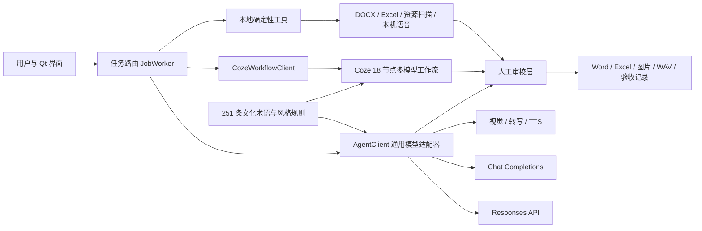
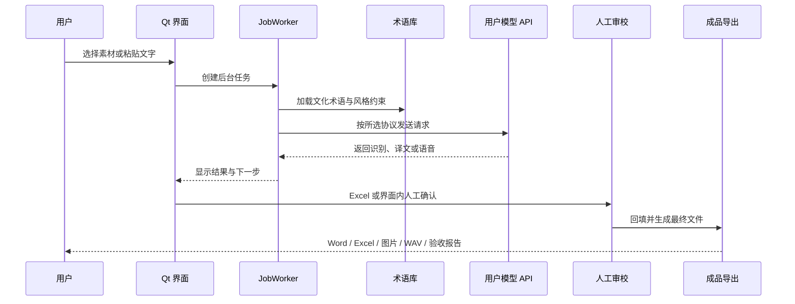

# 智能体架构

## 1. 设计目标

译述的智能体层负责把“用户想翻译什么”转换为可执行任务，并将模型输出接入术语约束、人工审校和文件导出。它不直接替代人工译者，而是把素材提取、机器初译、质量检查和技术回填组织成可追踪链路。

核心原则：

1. **用户按素材操作**：界面只要求选择图片、Word、音视频或粘贴文字。
2. **模型可替换**：支持 OpenAI Responses API、Chat Completions 兼容接口、本机 Ollama/LM Studio 和 Coze 工作流。
3. **结果可审校**：模型译文先进入界面或 Excel，不直接破坏源文件。
4. **离线可用**：DOCX 提取、版式回填、资源检索、验收和本机语音无需外部 API。
5. **密钥不出本机**：API Key 与 Token 只写入程序同目录的 `.env`，该文件被 Git 忽略。

## 2. 总体结构

## 3. 组件职责

| 组件 | 真实职责 | 主要文件 |
| --- | --- | --- |
| `MainWindow` | 页面导航、文件选择、状态反馈、模型接口配置 | `src/agent_gui_starter/app.py` |
| `JobWorker` | 后台执行任务，避免界面在网络请求或大文件处理时卡住 | `src/agent_gui_starter/app.py` |
| `AgentClient` | 统一文本、视觉、翻译、转写和语音接口；适配两种文本协议 | `src/agent_gui_starter/agent.py` |
| `CozeWorkflowClient` | 调用已发布的 Coze 多模型精译工作流并解析最终输出 | `src/agent_gui_starter/coze.py` |
| 配置层 | 加载、校验和本地保存模型地址、模型名、Key 与 Token | `src/agent_gui_starter/config.py` |
| 术语层 | 检索共享术语并向文字、图片和 Word 翻译注入约束 | `src/agent_gui_starter/integration.py` |
| 生产工具层 | DOCX 提取/回填、Excel 审校表、音频审校与配音 | `src/agent_gui_starter/production.py` |

## 4. 模型接入机制

左下角“模型接口”是全局模型连接中心。保存后，所有新任务会重新读取配置，不需要重启程序。

### 4.1 文本协议

- `responses`：适用于 OpenAI Responses API。
- `chat_completions`：适用于 OpenAI Chat Completions 及多数兼容服务。
- 本机地址为 `localhost`、`127.0.0.1` 或 `::1` 时允许无 Key 连接，便于使用 Ollama 和 LM Studio。

### 4.2 多模态能力

| 能力 | 在线调用 | 本地行为 |
| --- | --- | --- |
| 文字快速翻译 | 通用文本模型 | 无接口时展示明确的离线示例，不伪造线上结果 |
| 三步精译 | 同一模型依次完成分析、初稿、质检 | 保留三步可解释演示 |
| 图片识别翻译 | 视觉模型读取图片并带入术语约束 | 可打开已经完成并验收的图文成品 |
| Word 翻译 | 审校表分批调用文本模型 | 提取、人工编辑、回填和验收始终可离线 |
| 音频转写 | 用户配置的转写模型 | 无支持接口时明确提示 |
| 英文配音 | 用户配置的 TTS 模型 | 在线 TTS 不可用时回退 Windows 本机语音并记录原因 |
| Coze 多模型精译 | Coze Token + 工作流 ID | 未配置 Token 时展示真实结构的离线演示 |

## 5. 一次在线任务的执行路径

## 6. 安全边界

- `.env` 不进入 Git，网页部署也不包含桌面端用户密钥。
- GUI 使用密码输入框，不在状态栏和日志中显示完整 Key。
- “清除本机密钥”只删除 `OPENAI_API_KEY` 与 `COZE_API_TOKEN`，保留非敏感的模型名称和接口地址。
- 源文件不会被原地覆盖；新文件写入统一成品目录并保留时间戳。
- 兼容接口的能力可能不同。视觉、转写和 TTS 不受支持时给出真实错误或显式本机回退，不生成伪造结果。

## 7. 扩展方式

新增模型服务时优先保持 `AgentClient` 的统一接口；新增素材类型时在 `JobWorker` 增加路由，并把最终结果包装为 `ProductionResult`。这样界面、日志、成品目录和测试链路都能复用，不需要把供应商逻辑散落到各页面。
