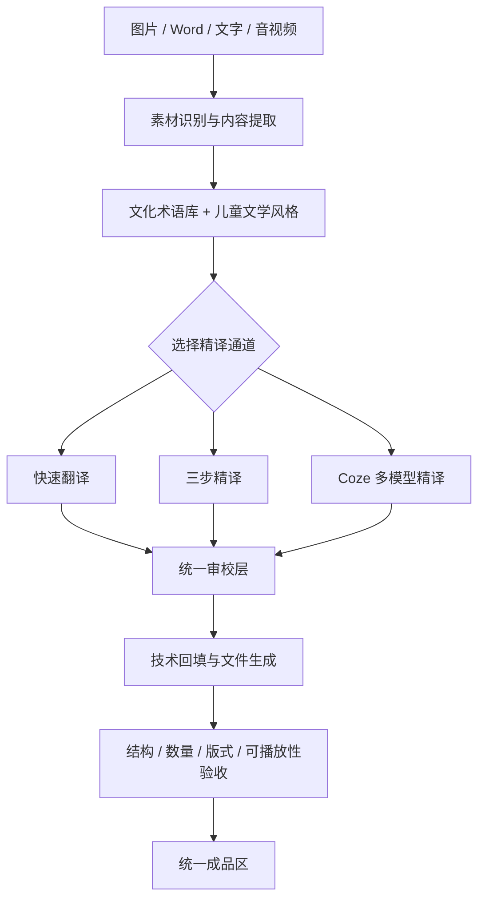
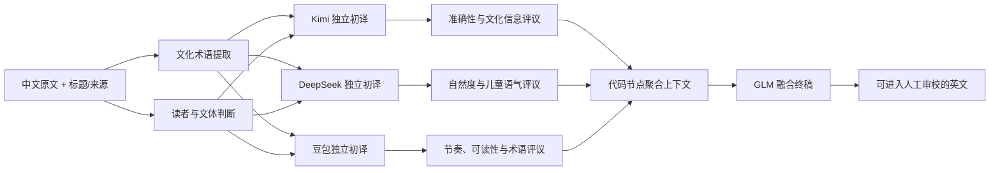
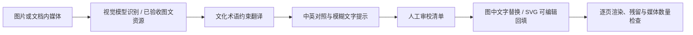
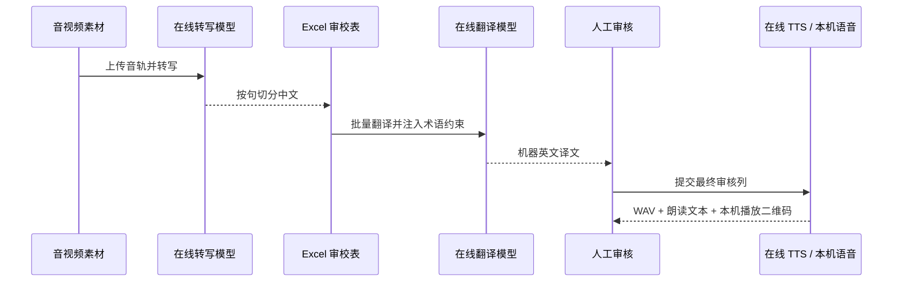

# 工作流架构

## 1. 工作流总览

译述将不同素材统一为“提取 -> 机器处理 -> 术语与风格约束 -> 人工审校 -> 技术回填 -> 验收导出”。各素材的提取和回填方式不同，但人工最终决定权与交付格式一致。

## 2. 三种文字翻译模式

| 模式 | 执行方式 | 适用场景 |
| --- | --- | --- |
| 快速翻译 | 单次模型调用，直接输出自然英文 | 短句、标签、临时说明 |
| 三步精译 | 需求理解 -> 执行草稿 -> 质量检查 | 正式说明、儿童文学、需要自检的长文本 |
| Coze 多模型精译 | 术语与文体分析 -> 三路独立初译 -> 交叉评议 -> GLM 融合 | 文化负载高、需要降低单模型偏差的重点内容 |

### 2.1 Coze 多模型精译工作流

Coze 工作流是项目的核心精译能力。仓库中保留的工作流经过图结构校验，包含 18 个节点和 28 条连接。以下是节点的逻辑分层，界面会同时展示结构证据和可理解的运行说明。

离线状态展示的是根据真实工作流结构生成的可解释演示；配置 Coze Token 后，同一入口调用线上已发布工作流。两种状态都有明确标签，避免把演示结果误认为网络调用结果。

## 3. 图片工作流

现有统一交付包含 71 条图中文字审校记录、31 个嵌入媒体、10 个可编辑 SVG 和 17 页最终文档渲染证据。在线视觉模型用于新素材识别与初译，已完成成品用于演示、复核和交付。

## 4. Word 工作流

1. 读取正文、表格、页眉与页脚，生成统一 Excel 审校表。
2. 在线模型按批次翻译空白条目，同时注入文化术语和儿童文学风格约束。
3. 人工在独立审核列修改译文；审核列优先于机器译文。
4. 通过 Word XML 精确回填，不改变图片、关系文件和原始版式结构。
5. 输出英文 DOCX 与 JSON 回填报告，记录命中数、未命中项和中文残留样本。

五套真实 DOCX 样例用于回归验证，覆盖正文、表格、页眉页脚和复杂版式。

## 5. 音视频工作流

在线 TTS 可用时优先生成模型语音；兼容服务不提供语音端点时，流程自动回退 Windows 本机语音，并把回退原因写入处理结果。

## 6. 批量整合工作流

批量流程用于全项目统一交付，不再按来源分组展示：

1. 扫描统一素材库并统计类型、数量和大小。
2. 加载文化术语、官方来源和儿童文学风格约束。
3. 校验统一成品区、哈希、可播放音频和验收 JSON。
4. 生成资源索引与整合报告。
5. 已连接模型时追加语义最终质检；未连接时完成全部本地结构验收并明确标记在线质检未启用。

## 7. 失败与回退策略

- 网络失败不删除已提取的审校表，也不覆盖原文件。
- 模型返回条目数与输入不一致时停止写入，避免行号错配。
- DOCX 回填失败会保存报告并指出具体 XML 文件。
- 图片过大、模型不支持视觉、音频端点不兼容时直接显示可操作错误。
- 在线 TTS 失败可回退本机语音；回退方式会出现在结果指标中。
- 所有生成物写入统一输出目录，可在“找成品”页面双击打开。

## 8. 验收证据

自动测试覆盖配置读取、Coze 请求、术语检索、DOCX 提取/翻译/回填、语音与二维码生成、主要页面渲染和入口交互。发布前还会执行标准窗口与最小窗口截图审稿、EXE 自检、ZIP 完整性检查以及 Vercel 桌面/移动端浏览器验证。
